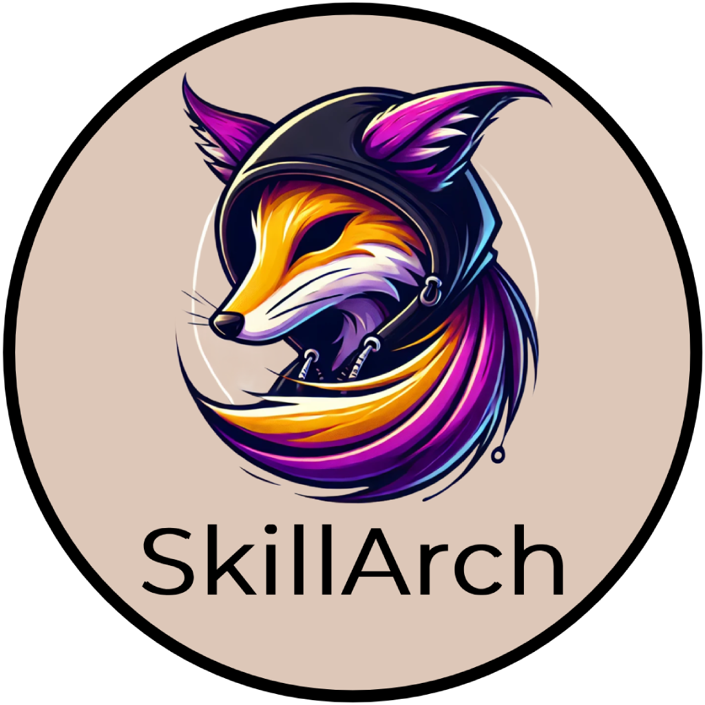

# SkillArch



- ⚠️⚠️⚠️⚠️⚠️⚠️⚠️⚠️⚠️⚠️⚠️⚠️⚠️⚠️⚠️
- ⚠️ This is an early work, no not use for now please 🥺🙏
- ⚠️⚠️⚠️⚠️⚠️⚠️⚠️⚠️⚠️⚠️⚠️⚠️⚠️⚠️⚠️

## How To

- First, download the `Desktop Edition` at https://cachyos.org/download/
- Install it (VM or physical), pick the `Gnome` flavor
- Then open `Console` and install SkillArch 🥂

```bash
git clone https://github.com/laluka/skillarch
sudo mv skillarch /opt/skillarch && cd /opt/skillarch
make install # Then reboot && pick i3 at login
```

> The install takes approx 30mn 🕑️\
> Please watch this intro video to onboard yourself! 🙏\
> ➡️ TODO(lalu) ⬅️

## Get Help

```bash
make help
# Welcome to SkillArch! 🌹

# Usage: make [target]
# Targets:

#   help                Show this help message
#   install             Install SkillArch
#   install-base        Install base packages
#   install-cli-tools   Install system packages
#   install-shell       Install shell packages
#   install-docker      Install docker
#   install-gui         Install gui, i3, polybar, kitty, rofi, picom
#   install-gui-tools   Install system packages
#   install-offensive   Install offensive tools
#   install-wordlists   Install wordlists
#   install-hardening   Install hardening tools
```

> Or join the SkillArch Discord server 🍀\
> ➡️ https://discord.com/invite/tH8wEpNKWS ⬅️\
> Yes, I help in the SkillArch channel, not in DMs! 😇

## Kudos

> Let's be honest, I put stuff together, but the heavy lifting is done by these true gods 😉

- https://github.com/bernsteining/beep-beep
- https://github.com/CachyOS/cachyos-desktop
- https://github.com/davatorium/rofi
- https://github.com/Hyde-project/hyde
- https://github.com/jluttine/rofi-power-menu
- https://github.com/newmanls/rofi-themes-collection
- https://github.com/orhun/config
- https://github.com/regolith-linux/regolith-desktop

## TODO BugFix & Improvements

- Neofetch logo
- Fix vbox copy paste
- Add CICD daily builds
- Alias update: make pull (error out on dirty state, take care of home & main branches only) && make install && make rebase
- Huge alias refacto

## TODO Documentation

- Config management & backups
- Update process
- What's inside (tools, alias, bindings)
- Kitty visual select (ctrl+alt+select)
- Document LITE mode (no php, no wordlists)
