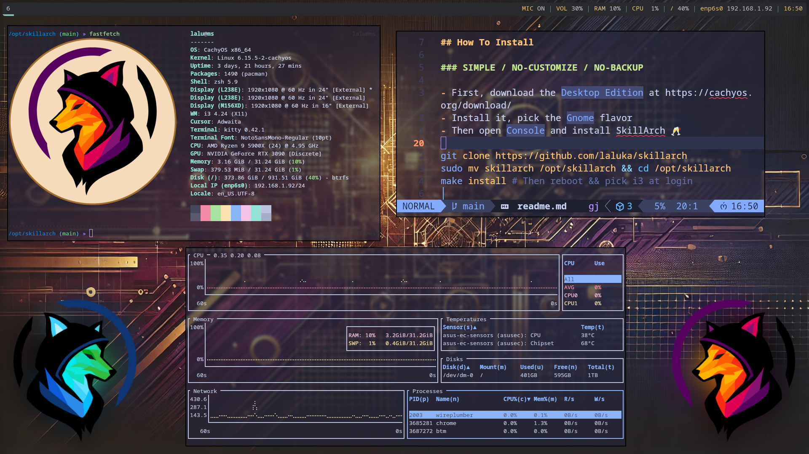

# SkillArch - [](https://github.com/laluka/skillarch/actions/workflows/docker.yml)


- ⚠️⚠️⚠️⚠️⚠️⚠️⚠️⚠️⚠️⚠️⚠️⚠️⚠️⚠️⚠️
- ⚠️ SkillArch is in `BETA` for now ⚒️
- ⚠️ Wait for `GA` for your main machine 🙏
- ⚠️⚠️⚠️⚠️⚠️⚠️⚠️⚠️⚠️⚠️⚠️⚠️⚠️⚠️⚠️

## How To

- First, download the `Desktop Edition` at https://cachyos.org/download/
- Install it, pick the `Gnome` flavor
- Then open `Console` and install SkillArch 🥂

```bash
git clone https://github.com/laluka/skillarch
sudo mv skillarch /opt/skillarch && cd /opt/skillarch
make install # Then reboot && pick i3 at login
```

> The install takes 15/20mn 🕑️\
> Please watch this intro video to onboard yourself! 🙏\
> ➡️ TODO:(lalu) ⬅️



---

## Get Help

```bash
make help
# Welcome to SkillArch! 🌹

# Usage: make [target]
# Targets:

#   help                Show this help message
#   install             Install SkillArch
#   install-base        Install base packages
#   install-cli-tools   Install system packages
#   install-shell       Install shell packages
#   install-docker      Install docker
#   install-gui         Install gui, i3, polybar, kitty, rofi, picom
#   install-gui-tools   Install system packages
#   install-offensive   Install offensive tools
#   install-wordlists   Install wordlists
#   install-hardening   Install hardening tools
#   install-tweaks      Manage user final tweaks
#   update              Update SkillArch
#   clean               Clean up system and remove unnecessary files
```

> Or join the SkillArch Discord server 🍀\
> ➡️ https://discord.com/invite/tH8wEpNKWS ⬅️\
> Yes, I help in the SkillArch channel, not in DMs! 😇

---

## Documentation

### Custom Config, Backups, Update

- `Update process` is supported
  - The `ska-update` alias checks that `/opt/skillarch` if in a clean git state
  - If dirty: It stops the update, you `MUST` clean your state (i.e. `git stast`), retry `ska-update`
  - If clean: It will `git pull` and `make install`
- `Custom tweaks` are supported
  - Due to the impossibility to "unbind" an i3 binding or "overwrite" omz configs after loading,
  - You `MUST` add your lines in `~/.config/skillarch/tweaks.sh` in a `modify-in-place` way (example inside)
  - You `SHOULD` backup your `~/.config/skillarch/tweaks.sh` in your own way (git ffs!)
- `Alternative Way` for a custom configs
  - Fork this repo (give a star, subscribe, follow, poce blo) 🙃
  - Monthly, pull upstream changes and `ska-update`
  - If you are a `power user`, feel free to `PR your lovely tweaks`!

Example Workflow:

1. Install Skillarch to the full
1. Add your config changes in `~/.config/skillarch/tweaks.sh`
  - Example: `sed -i 's#bg-0.jpg#nicebg.jpg#g' ~/.config/i3/config`
1. ~ Do your daily work & hak ~
1. One week later, you will run `ska-update`
1. The git state will be `dirty` because of your in-place change
1. So `git stash` (save current state to a local tmp stack)
1. Then run `ska-update` again, this will pull & install changes
  - Including `make install-tweaks` that will run `~/.config/skillarch/tweaks.sh`
1. Your state will be "dirty" again, but with the latest updates AND your custom config! 💎

> Of course, things CAN and probably WILL break, it's arch in latest yo!\
> Feel free to open an Issue/PR or come chat in the OffenSkill Community Discord! 😘

### Ska Helpers, i3 bindings, aliases, tools

| Alias | Description |
|-------|-------------|
| `ska-help-aliases` | Fuzzy-find aliases |
| `ska-help-bindings` | Fuzzy-find i3 bindings |
| `ska-help-packages` | Fuzzy-find installed packages |
| `ska-sudo-unlock` | Unlock current user after 3 sudo fails |
| `ska-update` | Update SkillArch repo & starts install |

### MISC Gotchas

- Kitty visual/rectangle select is done with `ctrl+alt+click/drag`
- The docker `latest` is actually the `lite` image with everything CLI related
- The docker `full` image contains GUI stuff and wordlists
- Why `sleep` in `Makefile`? Building TOO fast was triggering github limit-rate

### VM & VirtualBox Stuff

- The `ska-vbox-guestutils` alias will auto-install `virtualbox-guest-utils`
- In `VirtualBox`, when i3 starts it will run `VBoxClient-all` for clipboard & goodies
- Transparency `CAN` work with `picom` but:
  - It requires to enable `enable hardware virtualization`
  - It is basically `very slow` even with a good GPU
  - I advise to `not` use it, but do your things, PR opens!
  - Currently it's only started in i3 while not running in an hypervisor
  - In `~/config/i3/config` : `killall -q picom ; grep -qF hypervisor /proc/cpuinfo || picom`

### Main i3 bindings & aliases

- For aliases checkout [config/aliases](/config/aliases)

```bash
# Help
bindsym $mod+h exec kitty --title "Help: SkillArch Bindings" zsh -ic "ska-help-bindings"
bindsym $mod+Shift+h exec kitty --title "Help: SkillArch Aliases" zsh -ic "ska-help-aliases"
bindsym $mod+Control+h exec kitty --title "Help: SkillArch packages" zsh -ic "ska-help-packages"

# Sound & Light
bindsym XF86AudioRaiseVolume exec --no-startup-id pactl set-sink-volume @DEFAULT_SINK@ +10% && $refresh_i3status
bindsym XF86AudioLowerVolume exec --no-startup-id pactl set-sink-volume @DEFAULT_SINK@ -10% && $refresh_i3status
bindsym XF86AudioMute exec --no-startup-id pactl set-sink-mute @DEFAULT_SINK@ toggle && $refresh_i3status
bindsym XF86AudioMicMute exec --no-startup-id pactl set-source-mute @DEFAULT_SOURCE@ toggle && $refresh_i3status
bindsym XF86MonBrightnessUp exec --no-startup-id brightnessctl set +20%   # && notify-send --icon=/dev/null --expire-time=500 "Brightness +20%"
bindsym XF86MonBrightnessDown exec --no-startup-id brightnessctl set 20%- # && notify-send --icon=/dev/null --expire-time=500 "Brightness -20%"
bindsym $mod+m exec pactl set-source-mute @DEFAULT_SOURCE@ toggle

# Term & Apps
bindsym $mod+Return exec /usr/bin/kitty
bindsym $mod+Shift+Return exec /usr/bin/google-chrome-stable
bindsym $mod+Shift+Q kill
bindsym $mod+space exec --no-startup-id rofi -show run
bindsym $mod+Shift+space exec --no-startup-id rofi -show drun
bindsym $mod+Control+space exec --no-startup-id rofi -show window

# Power & Lock
bindsym $mod+Escape exec rofi -show power-menu -modi power-menu:rofi-power-menu
bindsym $mod+l exec i3lock-fancy -f Bitstream-Vera-Serif -t 'Welcome back to SkillArch'

# Window & Workspace
bindsym $mod+Left focus left
bindsym $mod+Down focus down
bindsym $mod+Up focus up
bindsym $mod+Right focus right
bindsym $mod+Shift+Left move left
bindsym $mod+Shift+Down move down
bindsym $mod+Shift+Up move up
bindsym $mod+Shift+Right move right
bindsym $mod+h split h
bindsym $mod+v split v
bindsym $mod+f fullscreen toggle
bindsym $mod+BackSpace split toggle
bindsym $mod+s layout stacking
bindsym $mod+z layout tabbed
bindsym $mod+BackSpace layout toggle split
bindsym $mod+Shift+f floating toggle
bindsym $mod+Shift+BackSpace focus mode_toggle
bindsym $mod+q focus parent
bindsym $mod+ampersand workspace number $ws1
bindsym $mod+eacute workspace number $ws2
bindsym $mod+quotedbl workspace number $ws3
bindsym $mod+apostrophe workspace number $ws4
bindsym $mod+parenleft workspace number $ws5
bindsym $mod+minus workspace number $ws6
bindsym $mod+egrave workspace number $ws7
bindsym $mod+underscore workspace number $ws8
bindsym $mod+ccedilla workspace number $ws9
bindsym $mod+agrave workspace number $ws10
bindsym $mod+Shift+1 move container to workspace number $ws1
bindsym $mod+Shift+eacute move container to workspace number $ws2
bindsym $mod+Shift+3 move container to workspace number $ws3
bindsym $mod+Shift+4 move container to workspace number $ws4
bindsym $mod+Shift+5 move container to workspace number $ws5
bindsym $mod+Shift+6 move container to workspace number $ws6
bindsym $mod+Shift+egrave move container to workspace number $ws7
bindsym $mod+Shift+8 move container to workspace number $ws8
bindsym $mod+Shift+ccedilla move container to workspace number $ws9
bindsym $mod+Shift+agrave move container to workspace number $ws10
bindsym $mod+Shift+c reload
bindsym $mod+Shift+r restart

# Resize
bindsym $mod+Shift+e exec "i3-nagbar -t warning -m 'You pressed the exit shortcut. Do you really want to exit i3? This will end your X session.' -B 'Yes, exit i3' 'i3-msg exit'"
bindsym Left resize shrink width 10 px or 10 ppt
bindsym Down resize grow height 10 px or 10 ppt
bindsym Up resize shrink height 10 px or 10 ppt
bindsym Right resize grow width 10 px or 10 ppt
bindsym Return mode "default"
bindsym Escape mode "default"
bindsym $mod+r mode "default"
bindsym $mod+r mode "resize"

# Custom Apps & Settings
bindsym $mod+p exec flameshot gui
bindsym $mod+Shift+p exec flameshot full -p ~/Pictures/
bindsym $mod+s exec pavucontrol
bindsym $mod+shift+s exec XDG_CURRENT_DESKTOP=GNOME gnome-control-center
bindsym $mod+e exec emote
bindsym $mod+b exec blueman-manager
bindsym $mod+w exec XDG_CURRENT_DESKTOP=GNOME gnome-control-center wifi
bindsym $mod+n exec nautilus
bindsym $mod+v exec vlc
bindsym $mod+c exec code
bindsym $mod+k exec cursor
```

### Main Changes Since [Lalubuntu](https://github.com/laluka/lalubuntu)

| What | Lalubuntu | SkillArch |
|------|-----------|-----------|
| OS | Ubuntu | Arch |
| Install time | 60mn | 20mn |
| Terminal | Gnome | Kitty |
| i3 config | regolith | homemade |
| Install tool | ansible | Makefile |
| Img builds | packer | docker |
| Images | base,offensive,gui | lite,full |
| Quality of Life | decent | wow! |

---

## Kudos

> Let's be honest, I put stuff together, but the heavy lifting is done by these true gods 😉

- https://github.com/bernsteining/beep-beep
- https://github.com/CachyOS/cachyos-desktop
- https://github.com/davatorium/rofi
- https://github.com/Hyde-project/hyde
- https://github.com/jluttine/rofi-power-menu
- https://github.com/newmanls/rofi-themes-collection
- https://github.com/orhun/config
- https://github.com/regolith-linux/regolith-desktop

---

## BugFix & Improvements

- Digital Ocean Vendor Images to allow an easy PoC of SkillArch
